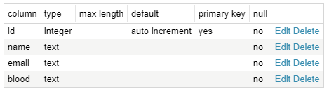
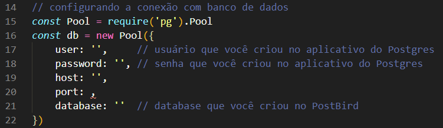

# Doe
Doe é um projeto desenvolvido durante a MaratonaDev 3.0 da Rocketseat. Tem como intuito ser um centro de doação de sangue.
***

## Tecnologias usadas:
* Express
* Nunjucks
* PostgreSQL
* *Nodemon - para desenvolvimento*

***
## Para iniciar:

### Comandos:

> * `npm install`

Após o comando acima executar:
*(executar apenas um dos comandos abaixo)*

> * `npm start` **→** para abrir **sem** o nodemon
>
> * `npm dev` **→** para abrir **com** o nodemon

***
### Banco de dados:
* Site de download
  * [PostgreSQL](www.postgresql.org/download)
  * [PostBird](www.electronjs.org/apps/postbird)

1. Crie sua conta no PostgreSQL;
2. Entre no PostBird, crie uma *database* com nome `doe`;
3. Crie uma tabela com nome `donors`;
4. Selecione a tabela `donors`, vá em `Structure` e deixe igual como a seguir:

Vá até o arquivo `server.js` e altere os parâmetros da variável `db`

